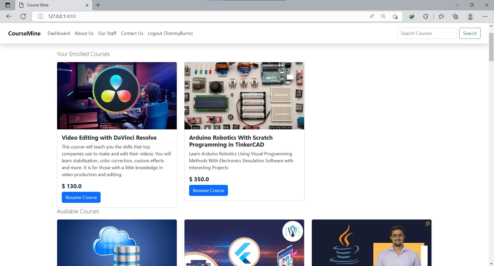

# CourseMine Online School
 An online school system built with Django.
 I started backend web development with Django a few weeks ago and I'm happy to publish my first app.🎉🎉

[Click here for the live preview](https://coursemine.herokuapp.com/)  
***Note*** Mobile responsiveness for some pages are very poor, the focus was on the backend.

## Overview
- It is an online school where users sign up as students.
- A person can only enroll in a course if he/she is a registered user(student).
- User dashboard is only visible to users who are logged in. And on the dashboard they can either resume a course they have bought or delete it if they are no longer interested.

#### Hompage


## Frameworks
- **Backend** - Django
- **Frontend** - Bootstrap

I look forward to building more interesting and powerful apps and your expert advice and guidance will be greatly appreciated.

## Below are screeshots of some of the pages
#### Homepage after login, with dashboard access

#### Display of search results

#### Course details page

#### User Dashboard

#### Resume Course Page


```js
const proud_of_myself = () => {
  console.log('🎉');
}

proud_of_myself();
```


## Author

- Twitter - [Thomas Burns Botchwey](https://www.twitter.com/tbbotchwey)
- LinkedIn - [Thomas Burns Botchwey](https://www.linkedin.com/in/tbbotchwey)